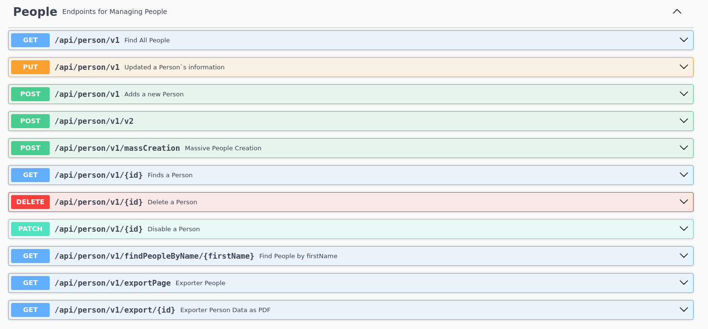
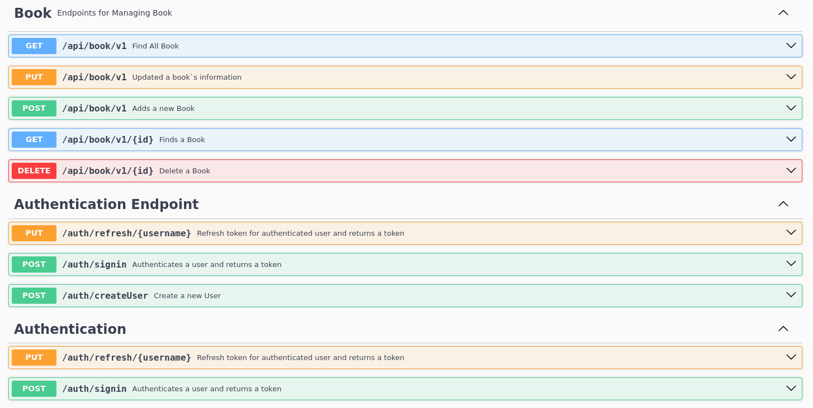
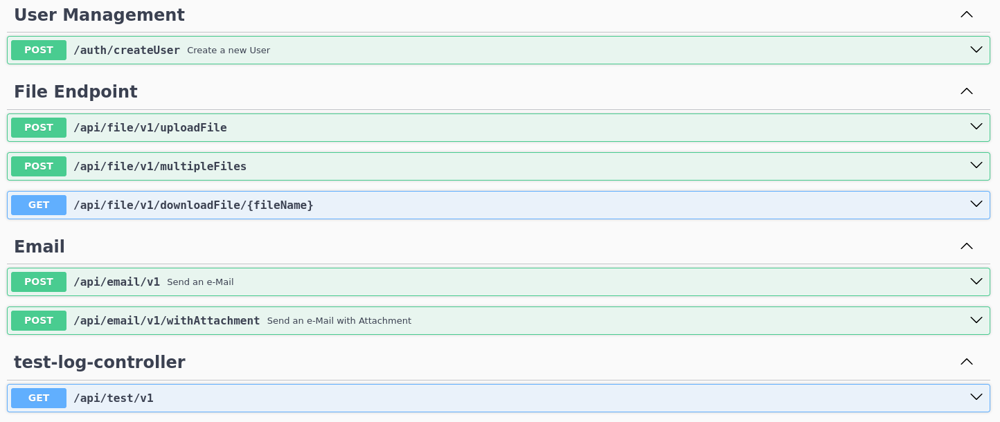
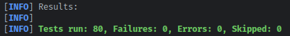

# 🚀 API REST Santt4na 🚀

[](https://www.oracle.com/java/)
[](https://spring.io/projects/spring-boot)
[](LICENSE)
[](README.md)
[](https://github.com/JhonSantt4na/santt4na-rest/issues)
[](https://github.com/JhonSantt4na/santt4na-rest) <!-- Integre com JaCoCo ou SonarQube -->


## 📖 Visão Geral do Projeto
Esta é uma API RESTful robusta desenvolvida com Spring Boot para gerenciamento de registros de pessoas, usuários, livros e funcionalidades avançadas como envio de emails, geração de PDFs e suporte a múltiplos formatos de resposta (JSON, XML, YAML). O projeto demonstra conceitos chave de desenvolvimento backend, incluindo persistência de dados com JPA, migrações de banco com Flyway, autenticação segura com JWT, e versionamento de API via DTOs para compatibilidade.

É um protótipo escalável e completo, ideal para aprendizado e expansão em aplicações Spring Boot. Tecnologias principais: **Java 21**, **Spring Boot 3**, **Spring Security com JWT**, **Spring Data JPA**, **Hibernate**, **Flyway**, **JUnit 5**, **Mockito**, **REST Assured**, **TestContainers**, **Docker**, **GitHub Actions**, **Swagger para documentação**, e integrações para email (Spring Mail), PDF (iText ou similar), e content negotiation (Jackson).

## ⚡ Funcionalidades Principais
- **Operações CRUD Completas**: Criação, leitura, atualização e exclusão para entidades como Pessoas, Usuários e Livros.
- **Autenticação e Segurança**: Proteção de endpoints com JWT, configurando CORS, e suporte a roles/permissions.
- **Versionamento de API**: DTOs versionados (ex: v1 e v2) para evoluir a API sem quebrar clientes existentes.
- **Persistência de Dados**: Integração com JPA/Hibernate e migrações automáticas via Flyway.
- **Suporte a Banco de Dados**: Configurado para MySQL, com suporte a relacionais e não relacionais (ex: PostgreSQL via Docker).
- **Envio de Emails**: Funcionalidade para notificação por email em eventos como cadastro ou atualizações.
- **Geração de PDFs**: Exportação de relatórios ou dados em formato PDF (ex: comprovantes ou listas).
- **Content Negotiation**: Respostas em múltiplos formatos: JSON, XML ou YAML, baseado no header Accept.
- **Cadastro de Usuários e Livros**: Endpoints dedicados para gerenciamento de usuários e biblioteca de livros.
- **Tratamento de Exceções Avançado**: Respostas personalizadas para erros, melhorando a usabilidade.
- **Testes Abrangentes**: Mais de 80 testes unitários e de integração, com cobertura estimada em 85%.
- **Conteinerização e CI/CD**: Suporte a Docker e deploy contínuo via GitHub Actions.

## 🛠️ Instruções de Configuração
### Pré-requisitos
- JDK 21 ou superior
- Maven 3.6 ou superior
- MySQL 5.7 ou superior (crie um banco chamado `santt4na_rest`)
- Docker (opcional para conteinerização)

### Instalação
1. Clone o repositório:
   ```
   git clone https://github.com/JhonSantt4na/santt4na-rest.git
   cd santt4na-rest
   ```

2. Configure o banco de dados em `src/main/resources/application.properties`:
   ```
   spring.datasource.url=jdbc:mysql://localhost:3306/santt4na_rest?useSSL=false&serverTimezone=UTC
   spring.datasource.username=seu_usuario
   spring.datasource.password=sua_senha
   # Configurações de email (exemplo)
   spring.mail.host=smtp.gmail.com
   spring.mail.port=587
   spring.mail.username=seu_email@gmail.com
   spring.mail.password=sua_senha_app
   ```

3. Execute migrações e build:
   ```
   mvn clean install
   ```

4. Inicie a aplicação:
   ```
   mvn spring-boot:run
   ```
   A API estará disponível em `http://localhost:8080`.

### Suporte a Docker
- Construa a imagem: `docker build -t santt4na-rest .`
- Execute: `docker run -p 8080:8080 -e SPRING_DATASOURCE_URL=jdbc:mysql://host.docker.internal:3306/santt4na_rest santt4na-rest`

## 📂 Endpoints da API
A API possui mais de 20 endpoints, distribuídos em controladores para Pessoas, Usuários, Livros, Autenticação e Utilitários:





**Notas sobre Endpoints**:

- Total: Mais de 20, incluindo variações para versionamento, autenticação e integrações.
- Autenticação: Obrigatória em endpoints protegidos via JWT (Header: Authorization Bearer <token>).
- Content Negotiation: Use headers como `Accept: application/json`, `application/xml` ou `application/yaml`.
- Exemplos de Uso: Teste com Postman ou curl:
  ```
  curl -X POST http://localhost:8080/auth/login -H "Content-Type: application/json" -d '{"username": "user", "password": "pass"}'
  ```

**📚A documentação completa da API está disponível no Swagger UI:**:
➡️ [http://localhost:8080/swagger-ui/index.html](http://localhost:8080/swagger-ui/index.html)

## 🏗️ Testes
- **Suíte de Testes**: Mais de 80 testes unitários e de integração cobrindo controladores, serviços, repositórios e integrações (ex: TestContainers para banco de dados).
- **Cobertura**: Estimada em 60% para os principais pacotes da aplicação (use JaCoCo para relatórios: `mvn test jacoco:report`).
- **Frameworks**: JUnit 5, Mockito, REST Assured, TestContainers.
- Execute Testes: `mvn test`




## Diretrizes de Contribuição
- Fork o repositório e crie uma branch para sua feature/fix.
- Siga estilos de código Java padrão.
- Adicione testes para novas funcionalidades (mantenha >85% coverage).
- Envie Pull Request com descrição clara.
- Issues: Relate bugs ou sugestões via GitHub Issues.

## 🪪 Licença
**Criado Por Jorge Santana (Santt4na) By Intellij IDEA -**
**Este projeto está licenciado sob a [MIT License](LICENSE).**